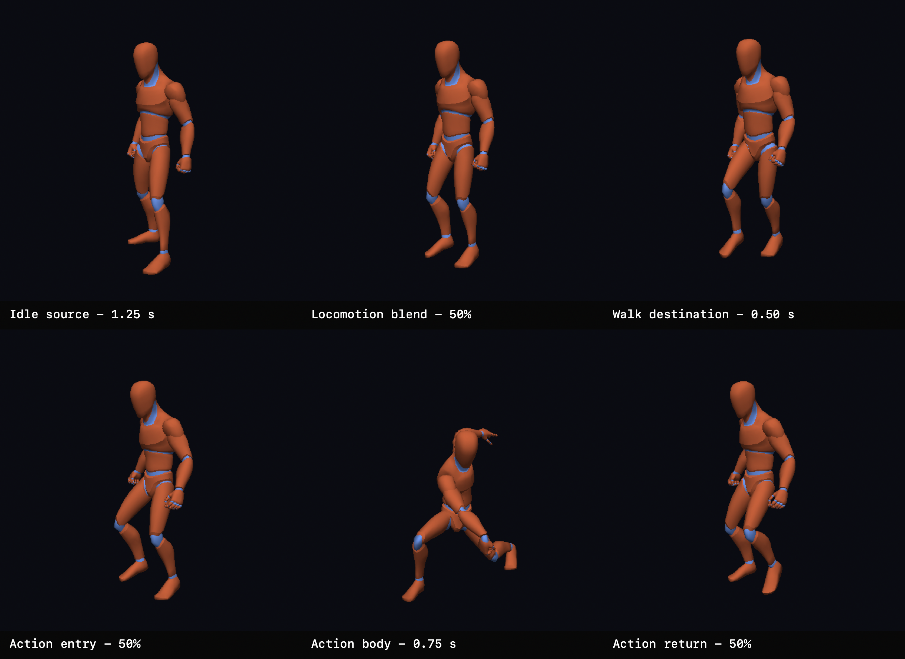

# First Locomotion And Action Crossfades

On 2026-08-01, the ChronoFall coordinator added its first focused full-body pose blending and proved smooth locomotion and action transitions through the native SDL GPU character harness.

## What This Records

The top row records the locomotion transition from `Idle_Loop` at 1.25 seconds through its 50% crossfade to `Walk_Loop` at 0.50 seconds. The bottom row records the 50% entry into `Sword_Attack`, the unclamped action body at 0.75 seconds, and the 50% return to the continuously advancing walk pose.

These are deterministic captures from the same pose-evaluation, GPU-skinning, render, and readback path used by the interactive browser. The sheet demonstrates the shape of both transitions; the owner separately exercised and approved their timing, interruption behavior, repeated action signals, controls, and skeleton overlay in the live native browser.

## Ownership And Evidence

- Owning task: `pm://project/prj_E7QP3LUocfY7k3PYM-EQOlqc/task/SHARED-0008`
- Experiment documentation: `pm://project/prj_E7QP3LUocfY7k3PYM-EQOlqc/wiki/experiments/sdl-gpu-bind-pose`
- Shared contract documentation: `pm://project/prj_E7QP3LUocfY7k3PYM-EQOlqc/wiki/architecture/shared-character-presentation`
- Selected source: `assets/Quaternius/Universal Animation Library[Standard]/Unreal-Godot/UAL1_Standard.glb`
- Supplied pack: `Universal Animation Library[Standard]`
- Source licence: CC0 1.0, as documented by the supplied Quaternius licence material and coordinator provenance wiki
- Preserved PNG dimensions: 3072 by 2240
- Preserved PNG SHA-256: `ffd916ad5af750faeddf20d9608a472ad80dc1f652b176299fe377f183d9a791`

The owner selected this contact sheet for permanent project-history preservation after validating the completed crossfades in the native browser.

## Generation

The native macOS ARM64 Metal harness wrote six deterministic 512 by 512 PPM captures to ignored temporary storage. Two independent suites compared byte-for-byte. The repository script `scripts/create-contact-sheet.swift` arranged the six source frames into this labeled sheet without cropping or altering their captured pixels.

The raw PPM files and duplicate repeatability suite remain untracked. Only this curated owner-approved derivative is preserved.
