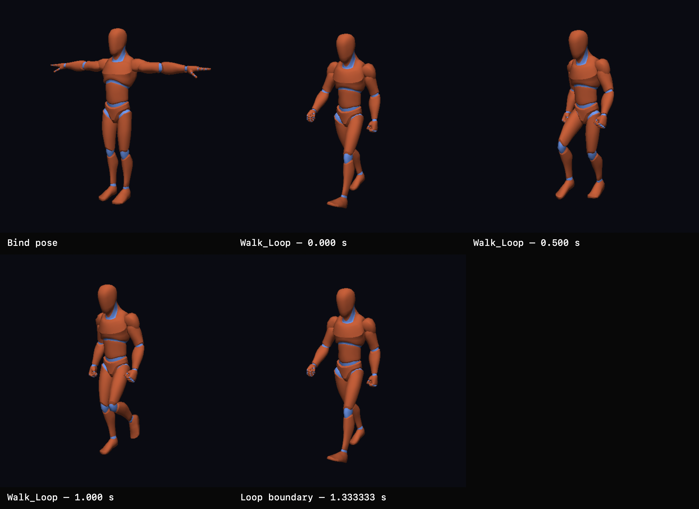

# First Deterministic Skinned-Character Capture Suite

On 2026-08-01, the ChronoFall coordinator produced its first deterministic multi-timestamp evidence for a GPU-skinned supplied character.

## What This Records

The sheet contains the selected humanoid in:

- its bind pose;
- `Walk_Loop` at 0.000 seconds;
- `Walk_Loop` at 0.500 seconds;
- `Walk_Loop` at 1.000 seconds;
- the exact 1.333333-second loop boundary.

The loop-boundary image is byte-identical to the animation-start image. The intermediate frames show distinct walk phases produced through the same SDL GPU skinning and readback path.

## Ownership And Evidence

- Owning task: `pm://project/prj_E7QP3LUocfY7k3PYM-EQOlqc/task/EXPERIMENT-0009`
- Experiment documentation: `pm://project/prj_E7QP3LUocfY7k3PYM-EQOlqc/wiki/experiments/sdl-gpu-bind-pose`
- Selected source: `assets/Quaternius/Universal Animation Library[Standard]/Unreal-Godot/UAL1_Standard.glb`
- Supplied pack: `Universal Animation Library[Standard]`
- Source licence: CC0 1.0, as documented by the supplied Quaternius licence material and coordinator provenance wiki
- Preserved PNG dimensions: 3072 by 2240
- Preserved PNG SHA-256: `709b7633adcb37055338740749a90ad17d980ff570763a5d5798641f76492f44`

The owner selected this contact sheet for permanent project-history preservation after reviewing the completed capture task.

## Generation

The native macOS ARM64 Metal harness wrote five deterministic 512 by 512 PPM captures under ignored `artifacts/EXPERIMENT-0009/` storage. Review copies were converted to PNG and arranged into this labeled sheet without regenerating or altering the captured frame pixels. The labels and layout are coordinator-authored documentation.

The raw PPM files, individual PNG review copies, and duplicate repeatability run remain ignored. Only this curated derivative is tracked.
