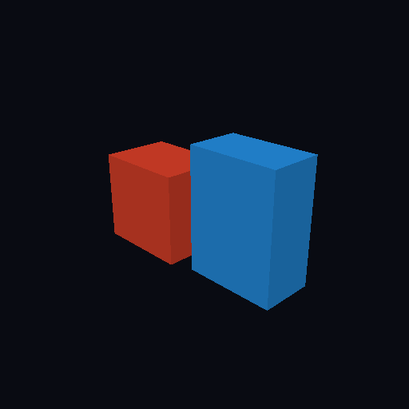

# First Shared Static-Mesh Rendering

On 2026-08-02, the ChronoFall coordinator rendered its first immutable static-mesh contract through the shared SDL GPU boundary.



## What This Records

The orange and blue boxes are differently proportioned sections of one deterministic synthetic mesh. Each section is drawn independently with an opaque caller-selected colour and the same directional-light contract. Their clean faces, stable framing and distinct silhouettes demonstrate the reviewed position/normal vertex layout, 32-bit indexed geometry, section ranges, depth testing and caller-owned draw recording.

The native harness also rendered a translated, rotated and uniformly scaled probe before repeating this exact baseline. The transformed frame differed, while the repeated baseline was byte-identical. The owner inspected the native macOS ARM64 Metal window, confirmed that the orange and blue boxes appeared correctly, and selected this baseline for permanent preservation.

This artifact does not claim compatibility with a supplied bow, village prop or other source asset. It does not prove UVs, textures, PBR materials, alpha, cooking, selection or child integration.

## Ownership And Evidence

- Owning task: `pm://project/prj_E7QP3LUocfY7k3PYM-EQOlqc/task/SHARED-0018`
- Shared contract documentation: `pm://project/prj_E7QP3LUocfY7k3PYM-EQOlqc/wiki/architecture/shared-character-presentation`
- Native experiment documentation: `pm://project/prj_E7QP3LUocfY7k3PYM-EQOlqc/wiki/experiments/sdl-gpu-bind-pose`
- Source geometry: coordinator-authored deterministic boxes from `SdlGpuStaticMeshHarness`; no supplied or third-party art asset
- External asset licence: not applicable
- Baseline GPU fingerprint: `247198b9ff0e2862`
- Transformed probe fingerprint: `7d2c37c52e46fb19`
- Repeated baseline fingerprint: `247198b9ff0e2862`
- Raw PPM SHA-256: `5c45a75532678dc94a69334d6d693b08d0f4544c247a92177d893acc690f0b43`
- Preserved PNG dimensions: 512 by 512
- Preserved PNG SHA-256: `6bd6e1be6a75a5fe4c8bda7bb5156a14c0d9e0c0399ba5ef2cf6c8bfc40a1624`

## Generation

The native harness produced the baseline with:

```sh
dotnet tests/ChronoFall.CharacterExperiment.GpuHarness/bin/Debug/net10.0/ChronoFall.CharacterExperiment.GpuHarness.dll \
  --static-proof \
  --static-capture <ignored-output>/static-mesh.ppm
```

The 786,447-byte P6 PPM was converted losslessly to this PNG with macOS `sips`. Automated validation rendered baseline, transformed and repeated frames in one native session, then launched two independent static harness processes and compared their captures byte-for-byte. The raw PPM and duplicate validation output remain ignored; only this owner-approved PNG is tracked.
