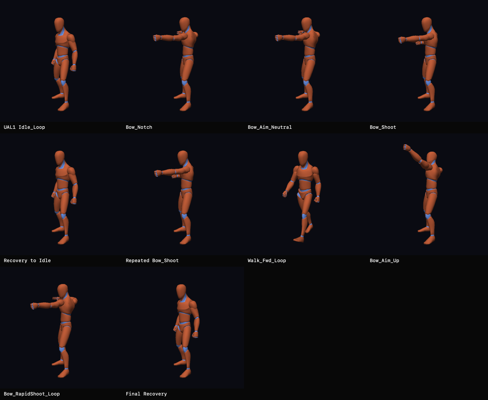

# First UAL2 Bow-Body Sequence

On 2026-08-03, the ChronoFall coordinator cooked and rendered its first coherent technical bow-body sequence from the owner-supplied Quaternius Universal Animation Library 2 Source package.

## What This Records

The sheet records the established UAL1 neutral idle followed by UAL2 notch, held aim, shot, recovery, repeated shot, generic locomotion, upward aim, rapid-shot, and final-recovery stages. It demonstrates that the selected non-root-motion clips can be sampled, blended, GPU-skinned, and presented coherently on the established 65-joint technical humanoid.

This is deliberately a **technical body-animation proof**. It does not contain a socketed bow, arrow, string interaction, projectile, combat timing, or final Starfall character. During frame-by-frame native review, the owner identified `Bow_Shoot` frame 3 at 100 ms as the first fully released body pose: frame 0 retains string-hand contact and frame 1 is only partially released. That marker is presentation evidence and must be revalidated once a real bow and arrow are attached.

## Ownership And Evidence

- Owning task: `pm://project/prj_E7QP3LUocfY7k3PYM-EQOlqc/task/EXPERIMENT-0014`
- Source and experiment documentation: `pm://project/prj_E7QP3LUocfY7k3PYM-EQOlqc/wiki/assets/quaternius-ual2-source-bow-evaluation`
- Bounded recipe: `assets/recipes/quaternius-ual2-source-bow-body.json`
- Private selected source identity: `Unreal-Godot/UAL2.glb`, SHA-256 `866c2ee822d30f0ceed521f50a5e84316d58ee4487d0b02158370bb988452416`
- Neutral reference source: `assets/Quaternius/Universal Animation Library[Standard]/Unreal-Godot/UAL1_Standard.glb`, clip `Idle_Loop`
- Supplied pack: Universal Animation Library 2 Source, owner-supplied snapshot inspected 2026-08-03
- Source licence: CC0 1.0, preserved through the supplied Quaternius licence material and coordinator provenance documentation
- Preserved PNG dimensions: 4096 by 3360
- Preserved PNG SHA-256: `d6e20dd281fd4d37d00d30dc9e7aa05795239fdf5f716c3ffbf321771dd700c5`

The owner validated the continuous native macOS ARM64 sequence and selected this contact sheet for permanent project-history preservation.

## Generation

The native Metal harness rendered deterministic 512 by 512 PPM captures through the same pose evaluation, blending, GPU-skinning, render, and readback path used by the interactive viewer. Two independently generated capture suites and their per-frame `Bow_Shoot` and `Bow_RapidShoot_Loop` evidence compared byte-for-byte.

The repository script `scripts/create-contact-sheet.swift` arranged ten owner-reviewed stages into this labeled PNG without cropping or altering captured pixels. The raw captures, per-frame release evidence, duplicate suite, cooked runtime artifact, and generated provenance remain ignored. Only this curated derivative is tracked; the complete purchased UAL2 Source package remains private and is not mirrored by the repository.
