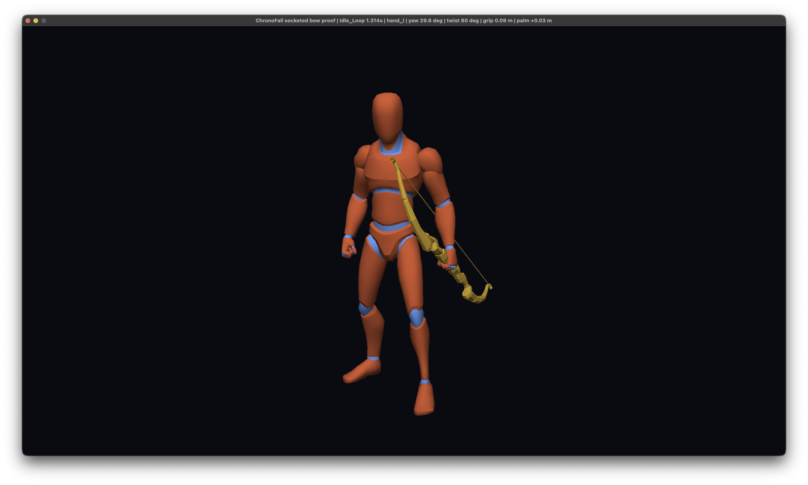

# First Socketed Static Bow

On 2026-08-06, the ChronoFall coordinator rendered the selected Quaternius `Bow_Wooden` as its first static attachment following a posed skeletal joint.

## What This Records

The selected static bow follows the UAL1 technical humanoid's posed `hand_l` joint and renders in the same caller-owned SDL GPU pass and depth target as the skinned character. The owner rotated and inspected the native proof, then froze the harness-local technical placement at an 80-degree twist, 0.09-metre grip offset and +0.03-metre palm-depth offset. The title bar preserves those accepted values in the selected view.

This proves the narrow shared socket-transform and static-attachment rendering path. It does not establish Starfall's semantic bow socket, final character placement, equipment, aiming, off-hand IK, string interaction, nocking, arrow presentation, projectile behavior or gameplay authority. Those remain child-owned work.

## Ownership And Evidence

- Owning task: `pm://project/prj_E7QP3LUocfY7k3PYM-EQOlqc/task/SHARED-0020`
- Shared presentation contract: `pm://project/prj_E7QP3LUocfY7k3PYM-EQOlqc/wiki/architecture/shared-character-presentation`
- Bow acquisition and provenance: `pm://project/prj_E7QP3LUocfY7k3PYM-EQOlqc/wiki/assets/quaternius-medieval-weapons-bow-arrow-cook`
- Humanoid source: `assets/Quaternius/Universal Animation Library[Standard]/Unreal-Godot/UAL1_Standard.glb`, SHA-256 `69591853d817488edaa8fd9bf8fc1d821eaeaf789f8627b3cd23b41c4ed67997`
- Bow source: `assets/Quaternius/Medieval Weapons Pack by @Quaternius/OBJ/Bow_Wooden.obj`, SHA-256 `788c9e72bdd839a86704113de4809a96cfedf09441bb3f98f383a7abfe751e6d`
- Cooked humanoid SHA-256: `37d2ecd2c614a4cc74fe359906c84408432100f0338b86d7ce4f4dddb6b585d3`
- Cooked bow SHA-256: `4c0ab766e7c622c0f52ff0ade3cb1992c6d96664233a4695fc049a3a9b1d642e`
- Supplied packs: Quaternius Universal Animation Library Standard and Medieval Weapons Pack
- Source licence: CC0 1.0, preserved in the supplied Quaternius licence material and coordinator provenance documentation
- Native backend: SDL GPU Metal on macOS ARM64
- Bow pixel counts at the deterministic 0 ms and 500 ms samples: `15426` and `15493`
- GPU fingerprints: `8d01823335cf6f94`, `4cb833897572116b`, repeated `8d01823335cf6f94`
- Preserved PNG dimensions: 2032 by 1220
- Preserved PNG SHA-256: `eaf657827f8976407ef2747326064b0c661d3fd2064d60ebca8931e07a712063`

The owner validated the native placement and selected this framed view for permanent project-history preservation.

## Generation

The coordinator GPU harness loaded the deterministic `.cfskel` and `.cfmesh` cooks, sampled `Idle_Loop`, resolved the `hand_l` global joint transform and composed the harness-local bow transform with the socket and character world transforms. Left-drag rotation allowed inspection from multiple angles without changing the attachment contract.

Automated validation rendered 0 ms, 500 ms and repeated 0 ms samples. The two animated samples differed, while the repeated sample matched byte-for-byte. Raw deterministic captures, cooked outputs and the original OS screenshot remain ignored; only this owner-selected PNG is tracked.
