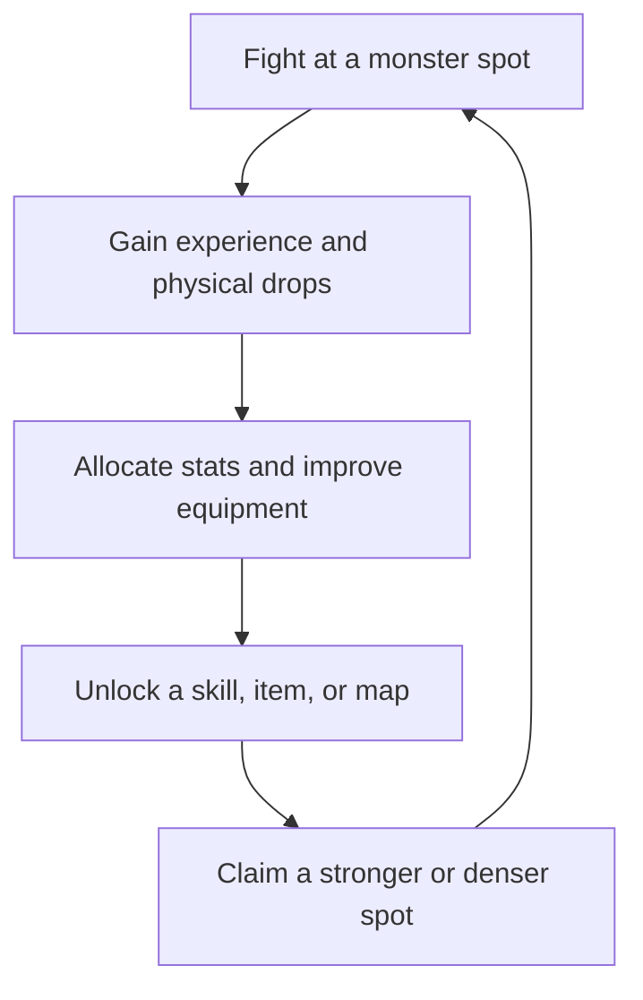

# MU Online Classic
## Design Anatomy and Adaptation Study

**Focus:** Core progression, combat, monster-spot grinding, class identity, player experience, and economy

**Historical target:** MU Online 0.97d, with selected early Season 0/1 ideas treated as an adjacent reference layer

**Document status:** Parts I–II; historical analysis followed by approved successor direction

**Date:** 31 July 2026

---

# Part I — Classic Design Anatomy

## 1. Purpose

This document has two connected purposes:

1. Explain why early MU Online worked as a game, particularly in its 0.97d-era form.
2. Translate those findings into design options for a modern MU-inspired game.

It is not a numerical reconstruction of a particular server. Exact experience curves, drop rates, formulas, and item tables varied between official releases and private servers, and those variations strongly shaped individual memories of MU. Numbers are included only when they reveal an important design relationship.

The document also avoids choosing prematurely between two possible projects:

- a faithful modern reinterpretation of MU’s original structure;
- a spiritual successor that preserves MU’s emotional and systemic identity while changing its controls and surface mechanics.

The central question is therefore not “How do we copy MU Online?” It is:

> What combination of systems made repeatedly killing monsters in the same place feel meaningful, memorable, and socially alive?

---

## 2. Historical Boundary

“Classic MU” is not one perfectly stable ruleset. The official game, regional versions, and private servers diverged in experience rates, drop rates, shops, available maps, item availability, reset rules, and even class unlock requirements.

For this document, the strict 0.97d core consists of:

- Dark Knight;
- Dark Wizard;
- Fairy Elf;
- Magic Gladiator as an account-level unlock;
- Lorencia, Noria, Devias, Dungeon, Lost Tower, Atlans, Tarkan, and Icarus;
- class changes around level 150;
- stat allocation;
- skill scrolls and orbs;
- item levels and options;
- jewels;
- Chaos Machine combinations;
- first and second wings;
- parties, guilds, and trading;
- Blood Castle, Devil Square, and golden invasions where enabled.

Dark Lord is treated as an **adjacent early-season reference**, not part of the strict 0.97d roster. The class matters to this study because its horse, raven, chain-like attacks, leadership fantasy, and unusual silhouette are some of MU’s strongest class-design ideas. Castle Siege, Crywolf, Fenrir, and other early-season additions are likewise useful references, but they should not silently distort the analysis of the smaller 0.97d game.

Reset systems are also not treated as part of the intended core. They were primarily a private-server answer to accelerated leveling and finite character growth. They generated longevity by making players repeat the level curve while retaining power, but they also weakened the meaning of individual levels and turned progression into numerical accumulation. The adaptation directions in this document assume **low-rate, persistent advancement without routine resets**.

---

## 3. Executive Design Thesis

Early MU Online was a mechanically simple combat game supported by an unusually effective progression machine.

Its appeal did not depend on quests, cinematic storytelling, elaborate rotations, large skill bars, or authored dungeons. It came from the alignment of several smaller systems:

- combat required very little input overhead;
- area skills made groups of monsters satisfying to erase;
- static monster concentrations turned geography into valuable knowledge;
- every level offered allocatable stats;
- stats unlocked equipment and skills rather than merely increasing hidden percentages;
- new skills changed the geometry and efficiency of grinding;
- rare drops could redirect an entire session;
- jewels were simultaneously crafting materials, risk tokens, and social currency;
- item upgrades were immediately visible on the character;
- class changes, advanced classes, and wings created long-range aspirations;
- players grinding in a shared world made otherwise repetitive activity social and territorial.

The result was a layered motivation structure:

| Horizon | Typical question in the player’s mind |
|---|---|
| Next few seconds | Can I gather and clear this group cleanly? |
| Next few minutes | Can I hold this spot without running out of potions or being displaced? |
| This session | Will I level, find a jewel, learn a skill, or replace a piece of equipment? |
| Next several sessions | Can I reach the next map, stat requirement, class change, or armor tier? |
| Long term | Can I obtain excellent equipment, unlock an advanced class, and earn wings? |

These goals overlapped. A player was rarely working toward only one thing.

---

## 4. Core Player Fantasy

The foundational fantasy of MU was not “complete a heroic narrative.” It was:

> Begin visually insignificant, then become unmistakably powerful in a world where other players can see the transformation.

The player’s appearance was a public record of progress. Better armor did not disappear beneath cosmetics. Upgraded equipment changed color and acquired stronger glow effects. Complete high-level sets produced additional effects. Wings changed both silhouette and movement. Advanced classes looked different. A powerful character standing in Lorencia or Devias communicated achievement before anyone inspected their stats.

This created three mutually reinforcing forms of progression:

- **Numerical progression:** levels, stats, damage, defense, speed, and survivability.
- **Functional progression:** new skills, better area coverage, access to maps, and the ability to hold stronger spots.
- **Visible progression:** armor tiers, weapon scale, colored glow, pets, mounts, and wings.

A modern adaptation should preserve all three. Numerical advancement without visible transformation loses MU’s social aspiration. Cosmetic transformation without functional advancement becomes ordinary skin collection. Functional advancement without a long numerical journey loses the sense that the character was built rather than merely configured.

---

## 5. The Core Progression Engine

### 5.1 The recurring loop

The loop was legible from the first minutes of play. There was little abstraction between effort and growth: kill monsters, watch the experience bar move, add points, equip something new, and kill faster.

The crucial design feature was that upgrades fed directly back into farming efficiency. A few stat points could satisfy the requirement for a weapon. A weapon could reduce the number of casts needed per group. A new area skill could make a previously awkward spawn pattern efficient. Better defense could allow the player to stop kiting and remain in the center of a spot.

Progress was therefore experienced as a change in behavior, not only as a larger number.

### 5.2 Levels as frequent decisions

The four classic attributes were Strength, Agility, Vitality, and Energy. Their importance differed by class:

| Attribute | General function | Interesting decision created |
|---|---|---|
| Strength | Physical power and equipment requirements | Spend for immediate damage or save toward a specific weapon or armor piece |
| Agility | Attack speed, defense, defense rate, bow damage | Improve tempo and survivability, often while chasing demanding equipment thresholds |
| Vitality | Health | Sacrifice efficiency for the ability to survive stronger monsters or unstable situations |
| Energy | Mana, spell power, skill scaling, Elf support strength | Unlock spells, improve area damage, or deepen the support role |

The system was not balanced around every stat being equally valuable. Its strength came from **threshold planning**. A player often knew the next piece of gear or scroll they wanted and allocated points toward its requirement.

This made equipment drops motivational even before they were usable. Finding an aspirational item created a personal short-term build plan:

> “I need another twelve Strength and six Agility before this becomes mine in practice.”

That is more emotionally effective than an item that becomes usable immediately and is discarded ten minutes later.

### 5.3 Skills as loot and milestones

Most skills were not selected from a conventional skill tree. They were learned from scrolls or orbs, found in shops or dropped by monsters, and gated by a stat or level requirement.

This combined three events:

1. obtaining knowledge of a skill;
2. building a character capable of learning it;
3. changing how the character fights once it is learned.

For the Dark Wizard, the path from Energy Ball through single-target spells, control effects, line attacks, and eventually Evil Spirits made increasing Energy feel like the expansion of a magical vocabulary. Evil Spirits was especially important because it changed the farming problem from “select and kill a target” to “occupy a good position and saturate the visible area.”

For the Fairy Elf, a bow carrying Multiple Shot immediately changed one arrow into a cone capable of striking several enemies—or the same close target multiple times. For the Dark Knight, Twisting Slash converted close-range vulnerability into an efficient circular clear. These were not minor damage upgrades. They changed the spatial logic of combat.

### 5.4 Map access as a progression reward

Classic MU’s maps formed a readable power ladder:

- starter fields around Lorencia and Noria;
- the snowfield of Devias;
- the increasingly dangerous floors of Dungeon;
- the seven-stage climb through Lost Tower;
- the altered movement and enemy combinations of Atlans;
- the desert pressure of Tarkan;
- the flight requirement and endgame spectacle of Icarus.

Level gates and traversal requirements made new maps feel earned. Icarus was particularly effective: the player did not merely select a higher-level zone from a menu. Entry required flight through wings or a Dinorant. The progression item and the world destination validated each other.

The maps also had distinct identities despite simple objectives. Snow, underwater movement, labyrinthine floors, traps, desert islands, and flight made advancement feel geographical.

### 5.5 Class change, account unlock, and wings

Classic MU used a small number of strong milestones instead of a constant stream of feature unlocks:

- the level-150 class-change quest;
- class-specific advanced equipment and skills;
- Magic Gladiator as a reward for raising an earlier character;
- Chaos weapons;
- first wings;
- second wings;
- access to the hardest maps and events.

These worked because they were far apart and visibly consequential.

The Magic Gladiator was an especially effective account-level aspiration. It was not merely another option on the initial character screen. Unlocking it proved that the player had already participated in the game’s progression. Its seven stat points per level, hybrid equipment access, lack of helmet, red-haired silhouette, and mixture of sword and magic made it feel like a rule-breaking reward.

Wings served a similar purpose at the character level. They were:

- a crafting achievement;
- a major visual transformation;
- a combat upgrade;
- a movement upgrade;
- an access key for Icarus;
- a public status marker.

Few progression rewards satisfy so many systems at once.

---

## 6. Itemization and the Meaning of Ownership

### 6.1 A small vocabulary with combinatorial value

Classic equipment was understandable at a glance:

- base item type and tier;
- item level, such as +0 through the classic upper range;
- Luck;
- a weapon skill where applicable;
- an additional damage, defense, defense-rate, or recovery option;
- excellent status and one or more excellent options.

The system did not need hundreds of affixes to create desirable objects. Rarity emerged from combinations players could understand.

An item could be valuable because it was:

- a higher base tier;
- usable sooner due to attainable requirements;
- upgraded;
- lucky;
- skilled;
- excellent;
- unusually well-optioned;
- part of a visually coherent set.

This kept trade conversation compact. Players could communicate an item’s identity in a short phrase because the property vocabulary was small and culturally shared.

### 6.2 Jewels as a perfect economy bridge

Jewels connected killing, upgrading, crafting, risk, and trading.

- Jewel of Bless advanced early item levels reliably.
- Jewel of Soul could advance later levels with failure risk.
- Jewel of Life improved an item option with its own risk.
- Jewel of Chaos enabled compound recipes such as Chaos weapons, wings, event tickets, and high-level upgrades.

Because jewels had direct use, scarcity, portability, and broadly understood value, they became a natural player currency even where Zen remained the formal NPC currency.

This is a powerful design pattern:

> The best player currency is not an abstract token awarded for commerce. It is a scarce, divisible object that almost every ambitious player is tempted to consume.

Every trade therefore carried an opportunity cost. Spending jewels on another player’s item meant not gambling them on one’s own equipment. Using jewels removed currency from circulation and created personal stories.

### 6.3 Risk made successful items personal

Higher upgrades could fail, lose levels, reset progress, or destroy materials. Chaos combinations could consume the entire recipe. This harshness made success memorable and gave upgraded items provenance.

The cost was equally real:

- failed progression could erase many sessions of effort;
- risk encouraged extreme conservatism;
- opaque probabilities made failure feel arbitrary;
- wealthy players could absorb variance much more easily;
- private-server monetization could turn risk into pay-to-win pressure.

The transferable lesson is not “destroy player items.” It is:

> An aspirational item becomes meaningful when completing it requires commitment, uncertainty, and a visible decision to risk accumulated value.

A modern implementation can preserve commitment without reproducing the most punitive outcomes.

### 6.4 Visual amplification

Item levels changed the appearance of equipment, culminating in persistent glow and complete-set effects. This was not decoration added after the progression system; it was part of the reward loop.

The visual language achieved several things:

- players could estimate another character’s advancement from a distance;
- a successful upgrade had an immediate sensory payoff;
- towns became showcases of possible futures;
- old base models remained exciting when upgraded;
- equipment ownership became social identity.

For an adaptation, glowing “+” items are a core pillar, not a nostalgic optional effect.

---

## 7. Combat Anatomy

### 7.1 Input model

Classic MU used an extremely compact interaction model:

- left-click to move or perform a basic attack on a target;
- right-click to use the selected skill;
- number keys to select assigned skills;
- Q, W, and E for consumables;
- Space to pick up a nearby recent drop;
- modifier inputs for PvP targeting.

There was little concept of a cooldown-based rotation. Combat tempo came from:

- attack and cast speed;
- mana and stamina consumption;
- potion use;
- target selection;
- positioning relative to monster groups;
- the geometry of the chosen skill;
- whether the character could withstand the spot.

The player often held or repeated a primary attack for long periods. Judged as a modern action game, this is shallow. Judged as the tactile front end of a progression-and-positioning game, it is coherent.

### 7.2 Why the simplicity worked

MU asked players to repeat combat thousands of times. Low input complexity reduced fatigue and left mental room for:

- watching the experience bar;
- inspecting drops;
- chatting;
- monitoring other players;
- deciding whether to contest or share a spot;
- managing potions;
- changing position when monster coverage became inefficient.

The combat was close to an activity that could become semi-automatic through mastery, but its rewards and social context kept demanding intermittent attention.

This balance is delicate. Too much automation removes ownership of the grind. Too much mechanical intensity makes the required repetition exhausting.

### 7.3 Skill geometry was class identity

MU’s most memorable skills were memorable partly because each solved a different spatial problem.

| Skill pattern | Representative classic expression | Farming meaning |
|---|---|---|
| Circular self-centered area | Dark Knight’s Twisting Slash | Stand inside a dense pack and turn durability into clearing efficiency |
| Screen-wide or broad area saturation | Dark Wizard’s Evil Spirits | Claim a central position and repeatedly cover a large spawn |
| Forward cone or split projectile | Fairy Elf’s Multiple Shot | Control approach lanes and exploit close-range multi-hit behavior |
| Piercing line | Aqua Beam, Penetration, Death Stab | Align enemies and reward lane positioning |
| Persistent or localized area | Flame and similar spells | Place damage where enemies will gather or respawn |
| Displacement or control | Lightning and Ice | Protect fragile builds and reshape a bad engagement |
| Hybrid ranged weapon attack | Magic Gladiator’s Power Slash | Give a sword-focused hybrid efficient mid-range group damage |

The adaptation lesson is to design skills around **coverage signatures**, not only damage coefficients. A newly learned skill should make the player reconsider which monster arrangement is best.

### 7.4 Potion pressure and sustain

Health and mana potions were immediate hotkey resources, not long-cooldown emergency abilities. Sustained farming was partly an economic and logistical calculation:

- How much inventory space is devoted to potions?
- How long can the player remain at the spot?
- Does a stronger area produce enough value to justify heavier consumption?
- Can an Energy Elf or party composition extend the session?
- Is the travel back to town costly enough that efficiency matters?

This gave attrition a purpose without requiring complex survival mechanics. A modern adaptation can streamline purchasing and stacking while retaining the question of sustainable uptime.

### 7.5 The combat’s weaknesses

The original model also created clear problems:

- optimal play could collapse into holding one button;
- limited active decisions made encounter variety weak;
- potion spam could become physical and economic busywork;
- click targeting and pathfinding were imprecise;
- high attack speed exposed engine and animation bugs;
- stat mistakes could invalidate a build for a long time;
- efficiency differences made some class fantasies poor solo experiences;
- long sessions encouraged unattended play and eventually formal auto-combat systems.

Modernization must improve expression without accidentally replacing MU’s cadence with a completely different genre.

---

## 8. Class Identity and Build Expression

### 8.1 Dark Knight: occupy the center

**Fantasy:** A durable physical warrior whose power is expressed through equipment weight, close-range commitment, and violent area control.

**Core loop:**

1. enter or gather a pack;
2. withstand contact;
3. clear around the body with Twisting Slash;
4. use directional or single-target skills for dangerous enemies;
5. convert Strength and equipment into the right to remain in increasingly hostile spots.

**Build tension:**

- Strength accelerates equipment and damage.
- Agility improves speed and defensive reliability.
- Vitality determines how aggressively the player can occupy space.
- Energy supports skill use and party durability through abilities such as Greater Fortitude/Inner Strength.

The class’s identity came less from a large moveset than from a simple territorial promise: if built correctly, the Knight could stand where fragile classes could not.

### 8.2 Dark Wizard: turn fragility into coverage

**Fantasy:** A physically vulnerable caster whose expanding library of spells transforms danger at a distance into overwhelming area control.

**Core loop:**

1. position before monsters converge;
2. choose a spell geometry appropriate to the spawn;
3. use control or teleportation to repair positioning;
4. sustain mana;
5. reach the Energy threshold at which a defining spell changes the grind.

The Wizard had one of the clearest power arcs. Early single-target magic felt constrained. Later spells added displacement, slowing, lines, local areas, and eventually broad screen coverage.

Evil Spirits was a qualitative milestone. It made the player feel as if the class had finally fulfilled its promise. The animation also exaggerated presence: the Wizard was not firing a slightly larger projectile but filling the battlefield with moving spectral forms.

### 8.3 Fairy Elf: two fantasies in one chassis

The Elf supported two strongly differentiated builds.

#### Agility Elf

**Fantasy:** A ranged weapon specialist whose attack speed, evasiveness, equipment demands, and multi-arrow geometry reward sustained investment in Agility.

Multiple Shot created a particularly memorable interaction: three arrows could spread across a group or converge on a nearby target. The skill was visually simple, immediately readable, and useful throughout progression.

The ammunition requirement added identity and logistics, although a modern game may not benefit from preserving routine arrow purchases.

#### Energy Elf

**Fantasy:** A force multiplier whose healing, attack buff, defense buff, and summoned creature make other players substantially more capable.

The Energy Elf was intentionally socially dependent and socially valuable. That asymmetry made party formation meaningful. A class did not need to deal equal solo damage to be desirable.

This design would be risky in a low-population modern game. It should be preserved only if:

- grouping is common and low-friction;
- the support player still performs interesting actions;
- solo progression remains possible, even if slower or structurally different;
- buffs do more than impose periodic maintenance.

### 8.4 Magic Gladiator: prestige through rule-breaking

**Fantasy:** An advanced hybrid that inherits sword and spell systems, gains more stat points per level, and can be built toward physical, magical, or mixed play.

Its most important design role was not balance. It was aspiration.

The Magic Gladiator:

- required prior account progress;
- gained seven stat points per level rather than five;
- shared significant portions of Knight and Wizard equipment;
- could combine physical and magical skills;
- used distinctive class weapons and attacks such as Power Slash;
- could run and traverse some environments more efficiently;
- could not wear a helmet, producing an immediately recognizable silhouette.

It made account progression unlock a new way to interpret already-familiar content.

For a modern successor, the lesson is stronger than “include a hybrid class.” The unlock should deliberately break a few rules the player has learned, while retaining meaningful weaknesses and a distinct visual identity.

### 8.5 Dark Lord as the adjacent expansion model

**Fantasy:** A battlefield commander whose authority is expressed through a Dark Horse, Dark Raven, scepter, Charisma, party utility, and commanding attack animations.

Dark Lord demonstrates how to add a class without merely filling a missing damage role. It introduces:

- a new stat identity through Command/Charisma;
- persistent companion entities;
- mounted combat;
- leadership and party-scale utility;
- a regal silhouette distinct from the original three archetypes.

In an adaptation, Dark Lord should be treated as evidence that MU’s class system can expand through **new rules and new verbs**, rather than through small variations on existing attacks.

---

## 9. Monster Spots: MU’s Unwritten Dungeon System

### 9.1 What a spot is

A monster spot is a small piece of world geography where a useful combination of enemies respawns at a predictable density and cadence.

The game did not formally label these spaces as encounters. Players discovered and named them. Examples such as Dungeon’s rapidly respawning “Bullroom” became socially recognized destinations.

A good spot balanced:

- number of monsters;
- distance between spawn positions;
- respawn time;
- monster damage and control effects;
- terrain obstruction;
- access from a safe area;
- expected experience and drops;
- competition from other players.

The player’s goal was not simply to reach the highest-level map. It was to find the strongest spot their current build could clear continuously without losing control of the spawn cycle.

### 9.2 Why static spawns were valuable

Static spawns converted world knowledge into mastery.

A player learned:

- where to stand;
- which direction to face;
- which skill covered the arrangement;
- which monster should die first;
- when to collect drops;
- how much sustain the location required;
- what party composition could upgrade the spot from barely viable to efficient.

The repetition became increasingly smooth as the player and character improved together.

### 9.3 Spots created soft ownership

Because good spots were shared and scarce, they acquired informal ownership. This generated:

- recognition between regular players;
- negotiation and party invitations;
- resentment and kill stealing;
- PvP escalation;
- guild protection;
- knowledge of quieter times and alternate locations.

This was not always pleasant, but it made the world feel inhabited. An instanced copy for every player would remove frustration and also remove much of the social texture.

### 9.4 Spots as a combat benchmark

A spot naturally answered several progression questions:

- Can the player survive the incoming damage?
- Can they clear the full group before the first monsters return?
- Can they sustain the mana cost?
- Can they collect drops without breaking the rotation?
- Does another skill or party member improve coverage?

The difference between “I can visit this place” and “I can own this rotation” gave power growth a practical measure.

### 9.5 Adaptation principle

A modern game should formalize the design of spots internally without over-explaining them to the player.

Every farming area should contain several authored spawn geometries:

- compact circular groups;
- lanes suitable for piercing attacks;
- split groups suitable for cones;
- dangerous high-density centers;
- safer low-density edges;
- mixed groups where control and target priority matter.

Class skills and world geometry should be designed together.

---

## 10. Player Experience Over Time

### Phase 1: Vulnerability and discovery

The player begins with poor equipment, limited skills, and visible nearby threats. Even a small drop matters. The first armor pieces rapidly change appearance.

**Emotional state:** curiosity, caution, frequent reward.

### Phase 2: The build forms

The player starts allocating stats toward known requirements. A defining early skill or skilled weapon establishes the class’s basic farming pattern.

**Emotional state:** agency and anticipation.

### Phase 3: Spot competence

The player stops wandering from monster to monster and learns to maintain a location. Efficiency becomes legible. Potions, inventory, and respawn timing enter the decision loop.

**Emotional state:** rhythm, ownership, incremental mastery.

### Phase 4: Social and economic awareness

Jewels begin to matter. Excellent items and advanced equipment become visible aspirations. Party composition changes experience gain and survivability. Other players become competitors, customers, teachers, or allies.

**Emotional state:** belonging, comparison, envy, opportunity.

### Phase 5: Transformation

Class change, a defining area skill, an advanced armor set, or access to a later map produces a discontinuity in power and appearance.

**Emotional state:** validation and renewed possibility.

### Phase 6: First wings

The player connects many systems—drops, jewels, item upgrading, Chaos combinations, and character level—to create a reward that is simultaneously functional, visual, social, and geographical.

**Emotional state:** arrival.

This is an excellent natural endpoint for the first complete progression arc of a new game, even if the larger game continues afterward.

---

## 11. Why Low Rate Matters

Low-rate progression is not valuable merely because it takes longer.

It works when time allows each tier to develop meaning:

- equipment is worn long enough to become familiar;
- a new skill is used long enough to reshape play;
- players learn maps rather than skipping them;
- finding a jewel changes the session;
- social relationships form around repeated presence;
- visible upgrades remain uncommon enough to attract attention;
- the next milestone stays distant but credible.

An excessively slow rate becomes empty attrition. An excessively fast rate collapses the ladder:

- early maps become disposable;
- item requirements stop being plans;
- class unlocks become menu friction;
- drops lose identity;
- wings become an expected tutorial reward;
- reset systems become necessary to manufacture another climb.

The right modern target should be specified in **meaningful experiences per hour**, not only experience multipliers. A session should usually contain at least one of:

- a visible level or stat threshold;
- a useful equipment decision;
- a meaningful trade or social interaction;
- progress toward a known recipe;
- discovery of a better spot;
- a rare-drop event.

The game may take substantial time to reach first wings, but it cannot ask the player to endure long stretches where none of those experiences occur.

---

## 12. What Must Be Preserved

The following are design invariants for either adaptation direction:

1. **Progress must be embodied.** Stats, equipment, skills, and appearance need to reinforce one another.
2. **Skills must change farming geometry.** A new ability should alter where or how the player fights.
3. **Good spots must be learned.** World knowledge should improve efficiency.
4. **Drops must remain physically and emotionally legible.** A jewel or excellent item should interrupt attention.
5. **Equipment must remain visible.** The character should display what they earned.
6. **Upgrades need commitment.** The process may be modernized, but high-end items should not be trivial or interchangeable.
7. **Wings must be earned.** They should be a major systemic milestone, not merely a purchased cosmetic.
8. **Class asymmetry should survive.** Classes should not be normalized into identical solo damage patterns.
9. **The game should tolerate social play during grinding.** Constant high-intensity input would undermine this.
10. **Routine resets should not be the progression backbone.**

---

## 13. What Should Not Be Preserved Uncritically

- opaque formulas that require external calculators for ordinary decisions;
- permanent build failure with no reasonable correction path;
- monotonous single-button combat with no positional decisions;
- manual potion purchasing and stacking as significant playtime;
- unreliable pathfinding and target selection;
- item destruction severe enough to erase motivation;
- support classes that cannot function when population is low;
- unrestricted spot monopolization by much stronger players;
- unattended auto-play as the intended solution to repetitive combat;
- experience rates so low that only passive or automated play is rational;
- private-server reset treadmills;
- pay-to-win shortcuts around rarity, upgrade risk, or class progression;
- cosmetic systems that hide earned equipment.

---

## 14. Adaptation Direction A: Faithful Modern Reinterpretation

This direction assumes that classic MU’s structure remains fundamentally valid and primarily needs better execution.

### 14.1 Combat

- Preserve isometric click-to-move and click targeting as the canonical model.
- Add optional direct movement where it does not invalidate spot geometry.
- Preserve a selected primary skill on right-click or an equivalent hold-to-cast input.
- Keep a small set of quickly selectable skills rather than a large MMO hotbar.
- Improve targeting, buffering, pathfinding, hit feedback, and animation blending.
- Add limited situational decisions—control, movement, resource bursts, or defensive timing—without turning every monster pack into an action-game encounter.

### 14.2 Progression

- Start with three strongly asymmetric base classes: Knight, Wizard, and Elf.
- Preserve manual Strength, Agility, Vitality, and Energy allocation.
- Use transparent equipment and skill thresholds.
- Retain a class-change milestone.
- Unlock a hybrid advanced class through account progress.
- Make first wings the conclusion of the first major progression arc.
- Avoid resets; continue progression through new maps, equipment, skills, and transformations.

### 14.3 World and spots

- Build a shared overworld with compact towns and authored hunting maps.
- Preserve static, learnable monster spots.
- Provide enough good alternatives that scarcity creates interaction without making harassment the optimal progression strategy.
- Keep towns socially dense and visually useful.
- Let travel and map access communicate advancement.

### 14.4 Items and economy

- Preserve a compact item vocabulary: base tier, level, Luck, skill, option, and excellent properties.
- Preserve jewels as both utility items and trade currency.
- Keep high-level upgrading risky, but introduce modern protection choices:
  - spend more materials to protect the base item;
  - accept a level reduction instead of destruction;
  - build a visible failure-progress meter for the rarest recipes.
- Preserve strong visual glow progression.
- Do not sell completed power or bypass materials.

### 14.5 Expected result

This game would feel immediately recognizable as a modern continuation of classic MU. Its main risk is preserving so much structural repetition that modern polish only makes an old retention model more comfortable rather than genuinely stronger.

---

## 15. Adaptation Direction B: Spiritual Successor

This direction preserves MU’s progression psychology and social geography while allowing the combat game to become more original.

### 15.1 Combat

- Use direct movement with mouse aiming or a hybrid isometric control scheme.
- Give each class a compact loadout of a primary sustained attack, a defining area skill, a movement or control tool, and one resource-sensitive power action.
- Preserve long farming cadence by keeping ordinary execution comfortable.
- Use skill geometry—circle, cone, line, orbit, persistent area—as the main source of class differentiation.
- Avoid universal dodge-roll combat; movement tools should reinforce class identity.

### 15.2 Progression

- Retain four understandable attributes or a similarly compact set.
- Make stats produce visible thresholds, not only smooth percentage scaling.
- Let skills be found, crafted, or earned in the world rather than granted entirely by a level-up menu.
- Let equipment requirements shape builds, while offering slow and costly respecialization.
- Replace direct class promotion with transformation paths that visibly alter the character.
- Treat the first flight-capable equipment as the major early-game culmination, even if it is not literally called wings.

### 15.3 World and spots

- Create interconnected hunting regions containing authored combat arenas.
- Preserve stable high-quality spots while allowing limited variation in monster composition or local hazards.
- Introduce “spot pressure” carefully: invasions, elite spawns, or temporary density changes can wake the player without erasing learned mastery.
- Keep some resources and encounters shared so other players remain relevant.

### 15.4 Items and economy

- Preserve a small number of highly legible modifiers.
- Use rare upgrade materials as the player-driven currency.
- Let repeated enhancement transform item visuals.
- Give rare items provenance through crafting history, successful risks, named creators, or world drops.
- Reduce total item volume so players inspect drops rather than filter thousands of them.

### 15.5 Expected result

This game could capture the feeling of building a powerful MU character without reproducing MU’s exact controls or content structure. Its primary risk is genre drift: enough modern action systems, randomized loot, active abilities, and dynamic events could turn it into a conventional isometric ARPG that merely borrows wings and glowing armor.

---

## 16. Comparison of the Two Directions

| Design question | Faithful reinterpretation | Spiritual successor |
|---|---|---|
| Movement | Click-to-move, with optional assistance | Direct or hybrid movement |
| Primary combat cadence | Hold/repeat a selected skill | Compact active kit built around a sustained primary action |
| Stats | Classic four attributes | Four attributes or a close functional equivalent |
| Skills | Scrolls, orbs, item skills, and class milestones | World-earned abilities with more flexible loadouts |
| Spots | Stable and mostly static | Stable cores with limited pressure or variation |
| Classes | Modernized versions of classic archetypes | New archetypes preserving classic spatial roles |
| Advanced class | Magic Gladiator-style account unlock | Rule-breaking prestige archetype |
| Economy | Jewels and Zen in recognizable roles | Utility materials naturally becoming trade currency |
| Upgrade risk | Classic structure with protection options | Commitment and uncertainty without necessarily copying destruction rules |
| Wings | Literal wings and Icarus-like access | Equivalent earned transformation and traversal unlock |
| Main danger | Recreating dated repetition | Losing MU’s identity through over-modernization |

---

## 17. A Shared First Prototype Question

Both directions can be evaluated with the same prototype question:

> Can one class fight at one carefully designed monster spot for twenty minutes while the player remains engaged by positioning, progression, drops, and anticipation rather than by constant mechanical intensity?

The prototype does not initially need:

- quests;
- a large world;
- PvP;
- guilds;
- raids;
- a complex crafting tree;
- multiple endgame systems.

It needs:

- one class with an early single-target attack and a defining area skill;
- one stat allocation decision;
- several equipment requirements;
- one compact map with at least three differently shaped spots;
- physical item and jewel drops;
- town return and equipment improvement;
- enough progression to make the same spot feel different before and after an upgrade.

If that loop is not satisfying, wings, classes, trading, and a larger world will only hide the problem temporarily.

---

## 18. Status of the Earlier Open Questions

The core combat-and-progression thesis has been approved. The earlier open questions now have the following status:

| Question | Current status |
|---|---|
| Time to wings | **Target:** approximately 50 hours to first wings, another 100 hours to second wings, and another 150–200 hours to the highest planned wings |
| World structure | **Locked:** traditional MMO with several selectable worlds/channels within a server |
| Monster-spot scarcity | **Experiment:** desirable and learnable, but not the sole activity; replenishment should discourage permanent occupation |
| Open-world PvP | **Direction:** relatively high risk outside towns, with obvious aggressor identity and meaningful disadvantages |
| Stat correction | **Target:** limited correction of recent investment; complete build changes require a new character |
| Active skill count | **Open:** must be learned through combat prototypes |
| Support and hybrid builds | **Target:** hybrids remain functional while specialized paired characters remain more efficient |
| Trading | **Locked:** free player-to-player trade is foundational |
| Upgrade loss and Luck | **Experiment:** meaningful risk remains; investment in Luck may reduce failure toward a non-zero floor |
| Prestige class | **Direction:** discovered in the world, but gated by non-transferable evidence of personal progression |
| First authored arc | **Locked:** first wings conclude the first end-to-end playable release |
| Adjacent-season systems | **Mixed:** commander archetype, utility pets, and purposeful mounts are retained; large events must be redesigned; guild territory is deferred |

---

## 19. Working Design Principles

The current design can be summarized in eighteen working principles:

1. **Repetition needs texture, not disguise.**
2. **A level should move the player toward a visible capability.**
3. **A defining skill changes the shape of efficient play.**
4. **A good spot is a piece of learned world knowledge.**
5. **Scarcity should create stories before it creates exclusion.**
6. **The best currency is useful enough to consume.**
7. **Rare equipment needs a readable identity.**
8. **Power should alter the character’s silhouette.**
9. **Asymmetric classes create reasons to meet other players.**
10. **Long-term rewards should connect several systems at once.**
11. **Low rate is valuable only while intermediate progress remains meaningful.**
12. **First wings are not merely an item; they are the proof that the whole progression game works.**
13. **A player’s appearance must tell the truth about their progression.**
14. **Items belong to the world before they belong to a build.**
15. **Trade is spatial before it becomes searchable.**
16. **New content should pay into the existing economy instead of creating a new currency.**
17. **Travel saves money; earned progression saves time.**
18. **Ordinary currency recirculates through the world rather than disappearing without an owner.**

---

# Part II — Chosen Direction and System Commitments

## 20. Decision Vocabulary

Part II distinguishes between decisions at different levels of certainty:

| Status | Meaning |
|---|---|
| **Locked** | A defining property of the intended game. Changing it would change the game’s identity. |
| **Direction** | A strong design commitment whose exact implementation remains open. |
| **Target** | A measurable aspiration used to guide design and testing. |
| **Experiment** | A hypothesis that must survive prototypes, telemetry, and player observation. |
| **Reserved** | An idea deliberately preserved for later without receiving present design scope. |
| **Later** | A known topic intentionally excluded from the first playable arc. |

This prevents an early numerical estimate from being treated as equivalent to an approved design pillar.

---

## 21. Approved Successor Direction

The project will pursue a **spiritual successor**, not a mechanically exact remake.

The approved core thesis is:

> A traditional MMO built around comfortable sustained combat, visible earned power, shared-world interdependence, free trade, meaningful risk, and long-term transformations that cannot be counterfeited with cosmetics.

The game may alter MU’s controls, encounters, skills, world structure, and class names. It must preserve the relationships that gave those systems meaning:

- fighting produces character growth, items, and economic opportunity;
- a stronger character looks stronger;
- new skills change the geometry of efficient play;
- other players are allies, competitors, customers, threats, and sources of knowledge;
- equipment remains an owned object with history, not a disposable recommendation;
- long-term transformations such as wings connect many systems at once.

This is a traditional MMO rather than a solo game with optional multiplayer. A player should not be able to complete an essentially single-player campaign and discover that the shared world has no continuing purpose. Role identity, commerce, danger, cooperation, and reputation all require other players to be structurally relevant.

---

## 22. Skill Acquisition: Found and Earned

The skill system will combine two acquisition models.

### 22.1 Early skills as world drops

Early skills may be learned from tangible objects:

- scrolls;
- orbs;
- weapon-bound techniques;
- runes;
- manuals;
- class-specific relics.

These items can drop from monsters, appear in a small number of shops, be found in the world, or pass between players where appropriate.

This model teaches several important lessons early:

- capability comes from participation in the world;
- a drop can matter even when it is not equipment;
- another class’s skill object may be valuable trade stock;
- obtaining a skill and becoming capable of using it are separate events;
- the character’s growth is not delivered entirely through a level-up menu.

Early skills establish the class’s basic spatial language: single target, circle, line, cone, persistent area, summon, control, or support.

### 22.2 Later skills as world-earned capabilities

Later defining skills should require meaningful interaction with the world:

- class trials;
- discoveries across several regions;
- difficult enemies;
- dangerous rituals;
- crafting;
- social or group accomplishments;
- demonstrations of existing class capabilities.

These should not collapse into ordinary quest completion followed by a text notification that a skill was unlocked.

A promising combined model is for the world-earned journey to culminate in a physical object that embodies the skill. The object may be consumed, attuned, or transformed by the character. The skill remains tangible without being reducible to a lucky drop.

The exact number of active skills and the shape of the moment-to-moment loadout remain open. They must be established through combat prototypes.

---

## 23. Truthful Visible Progression

**Status: Locked**

A player’s appearance is an authoritative expression of what that character has earned.

At a glance, another player should be able to infer:

- approximate equipment tier;
- upgrade investment through glow and material effects;
- weapon specialization;
- wing generation;
- important class transformation;
- meaningful companions or mounts;
- exceptional accomplishments that have altered the character.

The game must avoid cosmetic systems that allow a new or weak character to purchase the visual language of endgame power.

The governing rule is:

> Money must not counterfeit history.

If cosmetic customization eventually exists, it should remain subordinate to equipment truth. Possible safe forms include dyes, engravings, earned alternate variants within an equipment family, or ornamentation that cannot imitate a higher tier.

The equipped armor and weapon remain visually present. A full cosmetic outfit cannot simply override the items that define the character.

Wings are part of this visual grammar. Their generation must remain an immediately legible indicator of progression rather than becoming an interchangeable fashion slot.

---

## 24. Progression Pace and Rate Profiles

### 24.1 Wing targets

The current macro targets are:

| Transformation | Additional time | Approximate cumulative time |
|---|---:|---:|
| First wings | 50 hours | 50 hours |
| Second wings | 100 hours | 150 hours |
| Highest planned wings | 150–200 hours | 300–350 hours |

**Status: Target**

These values establish scale rather than a final experience curve. They are meaningful only if the intervening play remains varied and rewarding.

Fifty hours to first wings cannot mean fifty hours of aimless occupation of one spawn coordinate. The journey must contain:

- skill discoveries;
- equipment thresholds;
- new maps;
- changing monster arrangements;
- trade decisions;
- crafting preparation;
- shared events;
- class development;
- social opportunities;
- progress toward the wing transformation itself.

Different activities should contribute through the same crisp economy rather than introducing activity-specific currencies.

### 24.2 Development rate profiles

Server-controlled rates should remain configurable throughout development.

At minimum, the game should support independent tuning for:

- experience;
- ordinary item drops;
- rare item drops;
- material quantities;
- monster replenishment;
- event timing;
- crafting and upgrade chances;
- progression-gate requirements where safe.

Named profiles may include:

- `production-1x`;
- `development-10x`;
- `development-100x`;
- targeted profiles such as `economy-fast`, `wings-fast`, or `drops-fast`.

A universal multiplier is insufficient for serious balancing. Accelerated experience with ordinary drops tests under-equipped progression; accelerated drops with ordinary experience tests economic saturation. Fully accelerated progression is useful for reaching content quickly but cannot validate the intended economy.

Production 1x must be defined as an authored experience rather than a slower version of the development server.

---

## 25. World Structure and Hunting Ecology

### 25.1 Traditional server and world structure

**Status: Locked**

The game uses a traditional MMO structure. Each server contains several selectable worlds or channels. These worlds share the broad game identity while maintaining their own live population, monster state, trade stands, and local market directory.

This structure supports:

- population distribution;
- recognizable world communities;
- alternative hunting opportunities;
- local price differences;
- world-specific commercial activity;
- operational scaling without presenting the game as isolated private sessions.

The exact rules for transferring between worlds remain open.

### 25.2 Desirable but non-permanent monster spots

Monster spots remain valuable world knowledge, but standing in one location indefinitely must not become the entire progression game.

Premium spots should be:

- scarce enough to be discovered and remembered;
- plentiful enough that one guild cannot halt server progression;
- shaped for different skill geometries;
- affected by repeated harvesting;
- capable of recovering when neglected.

The replenishment model is an experiment.

One candidate is an ecological reserve:

- a spot accumulates unseen capacity while lightly used;
- repeated killing drains that capacity;
- density or replenishment gradually falls under sustained pressure;
- abandoned spots recover;
- players are encouraged to rotate, explore, and share knowledge.

The rule should probably respond to harvesting pressure rather than raw player count. A direct penalty for the number of nearby players would discourage parties. Grouping should remain efficient even if a group consumes a location’s reserve more quickly.

The world should communicate depletion and recovery through observable behavior rather than an arbitrary “spawn efficiency” percentage where possible.

---

## 26. PvP, Reputation, and Build Commitment

### 26.1 Open-world PvP

**Status: Direction**

PvP risk outside towns should be relatively high. The world must permit predation, retaliation, protection, and reputation.

Aggression should also carry persistent and unmistakable consequences:

- a visually obvious criminal or hostile state;
- restrictions on ordinary services;
- altered guard reactions;
- travel limitations or increased costs;
- increased vulnerability to other players;
- possible changes to death loss;
- a reputation that cannot be cleared immediately after an attack.

The goal is not to eliminate hostile players. It is to make aggression an identity and a strategic commitment rather than consequence-free interruption.

The exact criminality system, self-defense window, bounty rules, and death consequences remain open.

### 26.2 Limited stat correction

**Status: Target**

Players should be able to correct a small amount of recent stat investment. This protects against misclicks, misunderstandings, and short-term experimentation.

A complete transformation from one build identity to another should require a new character.

The correction rule may operate over:

- points earned during the last several levels;
- a fixed recent-point window;
- a costly but bounded number of reversals.

It must not become unrestricted respecialization between every activity.

### 26.3 Functional hybrid builds

Hybrid characters must work.

A specialized two-character pairing may outperform one hybrid character at its chosen extremes, but the hybrid must remain capable of progressing and participating as a coherent unit.

This is particularly important for support-oriented designs. A hybrid should sacrifice peak optimization, not basic viability.

---

## 27. Item Ownership, Trade State, and Upgrade Risk

### 27.1 Items belong to the world

**Status: Locked**

Loot should not be aggressively personalized to the current class and level.

A low-level character may find:

- equipment for a later level;
- equipment for another class;
- a rare skill object;
- a universally valuable jewel;
- an unusually strong version of an ordinary item.

The player can then keep, trade, gift, craft with, or build another character around that discovery.

This creates economic agency from the beginning of the game and ensures that a drop can be meaningful without being immediately equippable.

### 27.2 Free trade and exceptional trade states

Player-to-player trading is fundamentally free.

Some exceptional items may carry a temporary or removable trade restriction represented as an in-world state:

- sealed;
- cursed;
- claimed;
- attuned;
- bloodbound.

Crafting may be able to clear this state. The process could:

- risk destroying or degrading the item;
- consume universal materials;
- accept additional protection materials to reduce risk;
- create demand for trusted specialist crafters.

The terminology and mechanics remain experiments. The purpose is to make crafting economically meaningful without turning most equipment permanently untradeable.

### 27.3 Upgrade risk and Luck

High-end upgrading should retain a non-zero chance of failure.

Luck or an equivalent property may improve the odds toward a minimum failure floor, potentially as low as one percent. The initial success chance may begin around fifty percent for some high-risk process, but both numbers require experimentation.

The important commitments are:

- risk never disappears completely;
- preparation meaningfully improves the odds;
- players understand the risk before committing;
- additional protection requires existing valuable materials;
- item breakage is an acceptable sink where the player knowingly chose the risk.

---

## 28. A Crisp Shared Economy

**Status: Locked**

The economy must resist the modern tendency to introduce a new token for every activity.

Its intended shape is:

- one ordinary player currency;
- a very small family of universally understood jewel-like utility materials;
- equipment and skill objects;
- a few exceptional components for major transformations.

The governing rule is:

> New content pays into the existing economy instead of introducing its own currency.

Activities may differ in expected quantity, risk, item source, or access. They should still feed the same broadly useful materials.

The jewel-like materials should remain valuable because players continually choose between:

- consuming them for upgrades;
- protecting a risky craft;
- using them in a transformation;
- trading them for immediate equipment;
- holding them for a future opportunity.

This allows a level-10 player who cannot yet use a jewel to sell it to a veteran, then convert distant future value into an immediate visible upgrade.

---

## 29. Physical Trade Stands

### 29.1 Economic relevance across level bands

Both new and established players need plausible reasons to operate stands.

| Seller | Plausible stock | Buyer motivation |
|---|---|---|
| Early player | Jewel-like materials | Veterans continually consume them through upgrading, protection, and crafting |
| Early player | Rare equipment above their current level | Another developing character can use it immediately or soon |
| Early player | Cross-class skill objects | The correct class values something the finder cannot use |
| Veteran | Previous equipment | Developing characters gain a substantial visible upgrade |
| Veteran | Rare rolls and advanced equipment | Other veterans want particular combinations rather than merely a higher tier |
| Veteran | Crafted, cleansed, or protected items | Progression enables economically valuable capabilities |
| Any player | Buy orders and unusual barter offers | Currency is not the only way to express demand |

Early areas may produce universally valuable objects, but veterans should still gain better expected value by playing veteran content rather than exterminating beginner monsters.

### 29.2 Spatial commerce

**Status: Locked**

Before gaining access to the world market directory, players find commerce by moving through the world:

- visiting market streets;
- reading stand names and signs;
- responding to advertisements;
- inspecting other players’ stock;
- negotiating;
- learning where particular merchants operate.

Trade stands make players and towns economically relevant. They must remain physical world objects rather than rows in a global menu.

### 29.3 Persistent stands without AFK clients

**Status: Direction**

Opening a stand must not require a character and computer to remain AFK.

A player deploys a persistent booth, banner, attendant, projection, or similar world object carrying their identity. The player may continue playing or log out while the stand remains.

A stand may support:

- fixed-price sell orders;
- buy orders;
- item-for-item requests;
- simple bundles;
- direct contact with the owner;
- later, selected crafting services.

Market plazas or streets should organize stands without erasing location choice.

### 29.4 Duration and earned commercial presence

A stand may be opened for a short period without cost. Extending its presence for hours, a full day, or longer costs ordinary player currency.

The exact free duration and lease curve are experiments.

The intended effects are:

- a new player can sell one lucky discovery without prior wealth;
- abandoned stands disappear;
- serious merchants invest in market presence;
- crowded markets contain active economic intent;
- long-duration convenience is earned;
- stand leases feed the same economy rather than requiring merchant tokens.

Additional stand slots may increase rent, but the game does not currently require a separate merchant progression tree.

---

## 30. Endgame World Market Directory

### 30.1 Earned market visibility

**Status: Direction**

The global market capability is an endgame progression reward. It is not a universal menu available from character creation.

Each world maintains its own directory of the trade stands physically operating in that world. The directory aggregates existing commerce; it does not create a separate inventory pool.

The unlock should produce an “I did it” moment:

> Hours previously spent searching markets can now be compressed into a powerful overview because the character has earned access to the trade network.

The unlock should itself require real progression, not only a displayed level threshold.

### 30.2 Physical purchase versus remote acquisition

For an item listed at a stand price, the directory offers two paths:

1. Travel to the stand and buy at face value.
2. Submit a remote acquisition bid and pay a premium for avoiding travel.

The seller receives the listed face value. The premium is a system charge and does not raise the seller’s proceeds.

This preserves the physical asking price as the market’s authoritative price.

The governing rule is:

> Travel saves money; earned progression saves time.

### 30.3 Protecting physical discovery

Remote access should not allow wealthy veterans to remove every bargain before ordinary shoppers can encounter it.

Candidate protections include:

- an initial physical-only listing period;
- periodically refreshed rather than real-time indexing;
- a delay while remote acquisition completes;
- local purchase priority until the remote transfer secures the item;
- a flat minimum charge plus a percentage premium;
- a small number of active remote bids per player.

These details remain experiments.

The directory may reveal the stand’s location, allowing the player to choose between travel and premium. It should be accessible from a meaningful centralized location in the world rather than necessarily from anywhere.

### 30.4 Economic effect

The directory will increase liquidity and reduce extreme information asymmetry. It may make bargains disappear faster and gradually compress price differences.

That effect is accepted as part of the earned reward, provided:

- remote acquisition costs more;
- physical participation remains structurally cheaper;
- sellers receive their stated price;
- remote access has limits and delays;
- each world retains its own live market.

Physical stands must retain advantages even after much of the population reaches endgame:

- lower cost;
- immediate settlement;
- barter;
- negotiation;
- buy orders;
- unusual bundles;
- services the directory cannot fully represent.

---

## 31. Reserved Economic Thread: Area Funds

**Status: Reserved**

Ordinary player currency paid through systems should not disappear without an owner.

Potential sources include:

- remote acquisition premiums;
- trade-stand leases;
- future general taxes;
- other service charges.

These funds should be credited to an area, world, civic, or institutional fund. The exact ownership level is intentionally undefined.

Possible future uses include:

- loans to players;
- world or town improvements;
- shared infrastructure;
- server-level progression;
- growth unlocked by accumulated economic activity.

No loan design, governance model, voting system, interest rule, or improvement tree should be planned yet.

The present commitment is only:

> Items and materials may be destroyed through chosen crafting risk. Earned ordinary currency is transferred, held, or recirculated rather than deleted.

This may still function as a temporary currency sink while money remains held by the fund. Any later release back into circulation must consider inflation and abuse. Those problems are deliberately deferred.

---

## 32. Prestige Classes, Pets, Mounts, and Events

### 32.1 World-discovered prestige class

**Status: Direction**

The Magic Gladiator-like advanced class should be discovered in the world and gated by actual personal progression.

Knowing the location and sequence must not allow a new character to unlock it. Being escorted by a much stronger party must not bypass the requirement.

The world should react to evidence carried by the character:

- personally awakened capabilities;
- permanent states earned across several regions;
- class-specific feats;
- interaction with hazards requiring developed attributes or abilities;
- non-transferable history rather than a plain level check.

A veteran can guide another player toward the mystery, but cannot provide the internal character development necessary to complete it.

### 32.2 Commander archetype

**Status: Locked for the broader vision; not required in the first playable release**

An early post-foundation class should preserve the idea behind Dark Lord without copying the name:

- mounted or commanding silhouette;
- a combat-capable raven-like companion;
- leadership identity;
- unusual utility;
- interactions beyond ordinary damage.

The companion may fight, collect loot, or perform a limited skill-based attempt to seize exposed loot before another player collects it.

Loot interference must be telegraphed, counterable, constrained, and integrated with PvP or criminal reputation. It cannot become a spammable passive theft system.

### 32.3 Utility pets and purposeful mounts

Pets and mounts should exist because they do something.

Possible functions include:

- combat;
- collection;
- scouting;
- carrying;
- traversal;
- access to environmental routes;
- class-specific actions.

A mount is not merely a faster interchangeable vehicle skin. Fast travel and mount design must not make one another obsolete.

### 32.4 Events and territory

Shared special events are valuable because they synchronize player activity and make the world feel alive.

Castle Siege should either be discarded or fundamentally redesigned. Its original implementation is not accepted merely because it is iconic.

Guild territory is a later exploration and should not enter the initial plan.

---

## 33. First End-to-End Playable Release

**Status: Locked**

The first public “early look at an early-access game” ends with first wings.

The release must prove:

- the approved combat thesis;
- meaningful stat and equipment progression;
- early dropped skills and at least one world-earned capability;
- several hunting geometries;
- an initial shared-world structure;
- physical drops;
- a crisp jewel-like economy;
- free direct trade;
- persistent trade stands;
- crafting and upgrade risk;
- visible equipment progression;
- the first wing transformation.

It does not need to prove:

- second or third wings;
- the prestige class;
- the commander archetype;
- the endgame market directory;
- loans or area-funded world growth;
- guild territory;
- a final large-scale event model.

After the first wings release, development expands into advanced maps, second wings, deeper trade and crafting, new classes, and the larger shared-world systems.

---

## 34. Remaining Experiments

The following should not be answered through design prose alone:

1. Exact movement and aiming scheme.
2. Active skill count and input layout.
3. Combat intensity that remains comfortable over sustained sessions.
4. Monster reserve, depletion, and recovery formulas.
5. Party effects on spot replenishment.
6. Recent-stat correction window and cost.
7. Hybrid efficiency relative to specialized groups.
8. Base upgrade chances, Luck scaling, and minimum failure floor.
9. Trade-state cleansing cost and item-destruction rules.
10. Free stand duration, long-term rent, and listing capacity.
11. Directory indexing delay, remote premium, and local-priority window.
12. Exact requirements and presentation of prestige-class discovery.
13. Distribution of meaningful activities across the first 50-hour wing journey.

These become prototype and telemetry questions once implementation begins.

---

## 35. Research Notes

This document uses design-level conclusions rather than attempting to reconcile every regional or private-server ruleset.

Primary historical anchors:

- [2004 MU Online FAQ mirror](https://www.dlh.net/de/cheats/31476/mu-online.html) — contemporary descriptions of controls, classes, stats, skills, items, maps, parties, events, jewels, Chaos combinations, and wings.
- [MU Online official guide index](https://muonline.webzen.com/en/gameinfo/guide/total) — current official terminology and system lineage.
- [Official Magic Gladiator guide](https://muonline.webzen.com/en/gameinfo/guide/detail/243) — the class’s seven points per level, hybrid identity, Power Slash, and Fire Slash.
- [0.97d overview](https://guiamu.com.ar/page/version-del-mu-0-97d-118?lang=en) — period roster and map boundary.
- [Golden monster reference](https://muonlinefanz.com/guide/hunting/gold-monster/) — golden-monster geography and Box of Kundun reward structure, consulted with care because the living game has expanded far beyond 0.97d.

Where sources disagree, the document favors stable structural facts and explicitly labels version-sensitive conclusions. Private-server-specific rates, reset conventions, custom shops, later item tiers, and modern automated systems are excluded from the core unless discussed as contrasts.
